# Kebutuhan sebelum melakukan compile sendiri :


## Building in Mac OS X


Building in Mac OS X can be accomplished in just a few steps:

* Install general development tools (clang, make, git)
* Install ARM GCC 4.9 series compiler
* Checkout Cleanflight sourcecode through git
* Build the code

### Install general development tools (clang, make, git)

Open up a terminal and run `make`. If it is installed already, you should see a message like this, which means that you
already have the required development tools installed:

```
make: *** No targets specified and no makefile found.  Stop.
```

If it isn't installed yet, you might get a popup like this. If so, click the "install" button to install the commandline
developer tools:

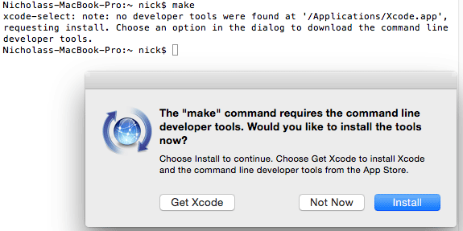

If you just get an error like this instead of a helpful popup prompt:

```
-bash: make: command not found
```

Try running `xcode-select --install` instead to trigger the popup.

If that doesn't work, you'll need to install the XCode development environment [from the App Store][]. After
installation, open up XCode and enter its preferences menu. Go to the "downloads" tab and install the
"command line tools" package.

[from the App Store]: https://itunes.apple.com/us/app/xcode/id497799835

### Install ARM GCC 4.9 series compiler

Cleanflight is built using the 4.9 series GCC compiler provided by the [GNU Tools for ARM Embedded Processors project][].

Hit the "all downloads" link on the right side of the GNU Tools for ARM page to view [the older releases][]. Grab the
Mac installation tarball for the latest version in the 4.9 series (e.g. 4.9-2015q2). Move it somewhere useful
such as a `~/development` folder (in your home directory) and double click it to unpack it. You should end up with a
folder called `~/development/gcc-arm-none-eabi-4_9-2015q2/`.

Now you just need to add the `bin/` directory from inside the GCC directory to your system's path. Run `nano ~/.profile`. Add a
new line at the end of the file which adds the path for the `bin/` folder to your path, like so:

```
export PATH=$PATH:~/development/gcc-arm-none-eabi-4_9-2015q2/bin
```

Press CTRL+X to exit nano, and answer "y" when prompted to save your changes.

Now *close this terminal window* and open a new one. Try running:

```
arm-none-eabi-gcc --version
```

You should get output similar to:

```
arm-none-eabi-gcc.exe (GNU Tools for ARM Embedded Processors) 4.9.3 20150529 (release) [ARM/embedded-4_9-branch revision 224288]
Copyright (C) 2014 Free Software Foundation, Inc.
This is free software; see the source for copying conditions.  There is NO
warranty; not even for MERCHANTABILITY or FITNESS FOR A PARTICULAR PURPOSE.
```

If `arm-none-eabi-gcc` couldn't be found, go back and check that you entered the correct path in your `~/.profile` file.

[GNU Tools for ARM Embedded Processors project]: https://launchpad.net/gcc-arm-embedded
[the older releases]: https://launchpad.net/gcc-arm-embedded/+download

### Checkout CleanFlight sourcecode through git

Enter your development directory and clone the [Cleanflight repository][] using the "HTTPS clone URL" which is shown on
the right side of the Cleanflight GitHub page, like so:

```
git clone https://github.com/cleanflight/cleanflight.git
```

This will download the entire Cleanflight repository for you into a new folder called "cleanflight".

[CleanFlight repository]: https://github.com/cleanflight/cleanflight

### Build the code

Enter the cleanflight directory and run `make TARGET=NAZE` to build firmware for the Naze32. When the build completes,
the .hex firmware should be available as `obj/cleanflight_NAZE.hex` for you to flash using the Cleanflight
Configurator.

### Updating to the latest source

If you want to erase your local changes and update to the latest version of the Cleanflight source, enter your
cleanflight directory and run these commands to first erase your local changes, fetch and merge the latest
changes from the repository, then rebuild the firmware:

```
git reset --hard
git pull

make clean TARGET=NAZE
make TARGET=NAZE
```


---

## Building in Ubuntu


Building for Ubuntu platform is remarkably easy. The only trick to understand is that the Ubuntu toolchain,
which they are downstreaming from Debian, is not compatible with Cleanflight. We suggest that you take an
alternative PPA from Terry Guo, found here:
https://launchpad.net/~terry.guo/+archive/ubuntu/gcc-arm-embedded

This PPA has several compiler versions and platforms available. For many hardware platforms (notably Naze)
the 4.9.3 compiler will work fine. For some, older compiler 4.8 (notably Sparky) is more appropriate. We
suggest you build with 4.9.3 first, and try to see if you can connect to the CLI or run the Configurator.
If you cannot, please see the section below for further hints on what you might do.

### Setup GNU ARM Toolchain

Note specifically the last paragraph of Terry's PPA documentation -- Ubuntu carries its own package for
`gcc-arm-none-eabi`, so you'll have to remove it, and then pin the one from the PPA.
For your release, you should first remove any older pacakges (from Debian or Ubuntu directly), introduce
Terry's PPA, and update:
```
sudo apt-get remove binutils-arm-none-eabi gcc-arm-none-eabi
sudo add-apt-repository ppa:terry.guo/gcc-arm-embedded
sudo apt-get update
```

For Ubuntu 14.10 (current release, called Utopic Unicorn), you should pin:
```
sudo apt-get install gcc-arm-none-eabi=4.9.3.2014q4-0utopic12
```

For Ubuntu 14.04 (an LTS as of Q1'2015, called Trusty Tahr), you should pin:
```
sudo apt-get install gcc-arm-none-eabi=4.9.3.2014q4-0trusty12
```

For Ubuntu 12.04 (previous LTS, called Precise Penguin), you should pin:
```
sudo apt-get install gcc-arm-none-eabi=4.9.3.2014q4-0precise12
```

### Building on Ubuntu

After the ARM toolchain from Terry is installed, you should be able to build from source.
```
cd src
git clone git@github.com:cleanflight/cleanflight.git
cd cleanflight
make TARGET=NAZE
```

You'll see a set of files being compiled, and finally linked, yielding both an ELF and then a HEX:
```
...
arm-none-eabi-size ./obj/main/cleanflight_NAZE.elf
   text    data     bss     dec     hex filename
  97164     320   11080  108564   1a814 ./obj/main/cleanflight_NAZE.elf
arm-none-eabi-objcopy -O ihex --set-start 0x8000000 obj/main/cleanflight_NAZE.elf obj/cleanflight_NAZE.hex
$ ls -la obj/cleanflight_NAZE.hex                                                                                                                                                 
-rw-rw-r-- 1 pim pim 274258 Jan 12 21:45 obj/cleanflight_NAZE.hex
```

You can use the Cleanflight-Configurator to flash the ```obj/cleanflight_NAZE.hex``` file.

### Bricked/Bad build?

Users have reported that the 4.9.3 compiler for ARM produces bad builds, for example on the Sparky hardware platform.
It is very likely that using an older compiler would be fine -- Terry happens to have also a 4.8 2014q2 build in his
PPA - to install this, you can fetch the `.deb` directly:
http://ppa.launchpad.net/terry.guo/gcc-arm-embedded/ubuntu/pool/main/g/gcc-arm-none-eabi/

and use `dpkg` to install:
```
sudo dpkg -i gcc-arm-none-eabi_4-8-2014q2-0saucy9_amd64.deb
```

Make sure to remove `obj/` and `make clean`, before building again.

### Updating and rebuilding

Navigate to the local cleanflight repository and use the following steps to pull the latest changes and rebuild your version of cleanflight:

```
cd src/cleanflight
git reset --hard
git pull
make clean TARGET=NAZE
make
```

Credit goes to K.C. Budd, AKfreak for testing, and pulsar for doing the long legwork that yielded this very short document.


---


## Building in windows


### Setup Cygwin

download the Setup*.exe from https://www.cygwin.com/

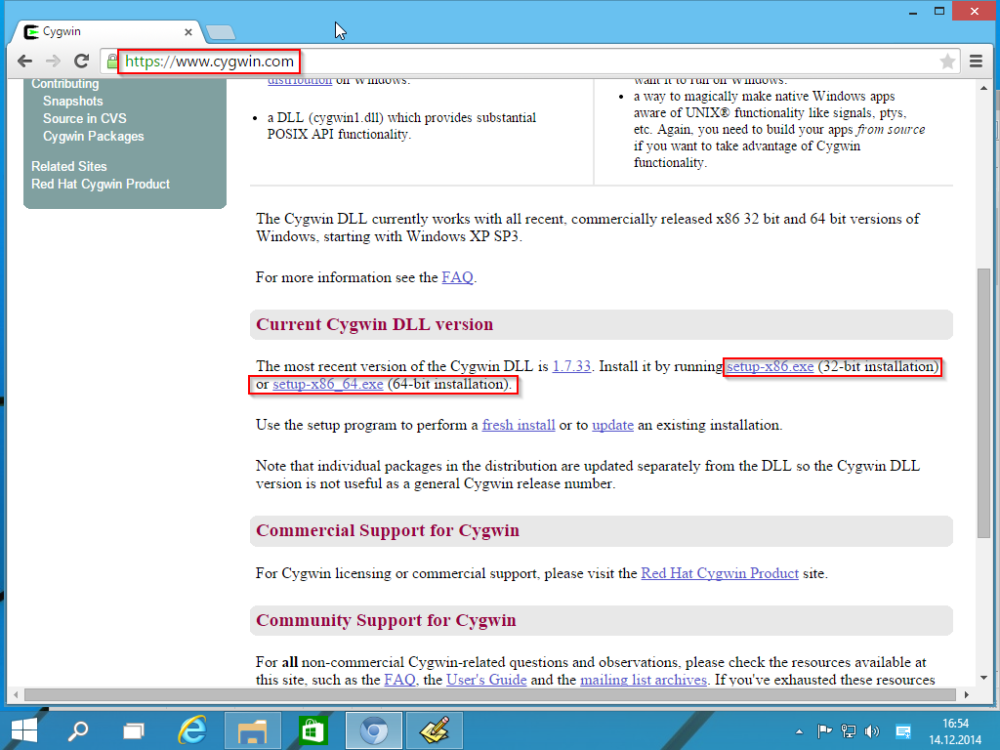

Execute the download Setup and step through the installation  wizard (no need to customize the settings here). Stop at the  "Select Packages" Screen and select the following Packages
for Installation:

- Devel/git
- Devel/git-completion (Optional)
- Devel/make
- Devel/binutils
- Editors/vim	 
- Editors/vim-common (Optional)
- Shells/mintty (should be already selected)

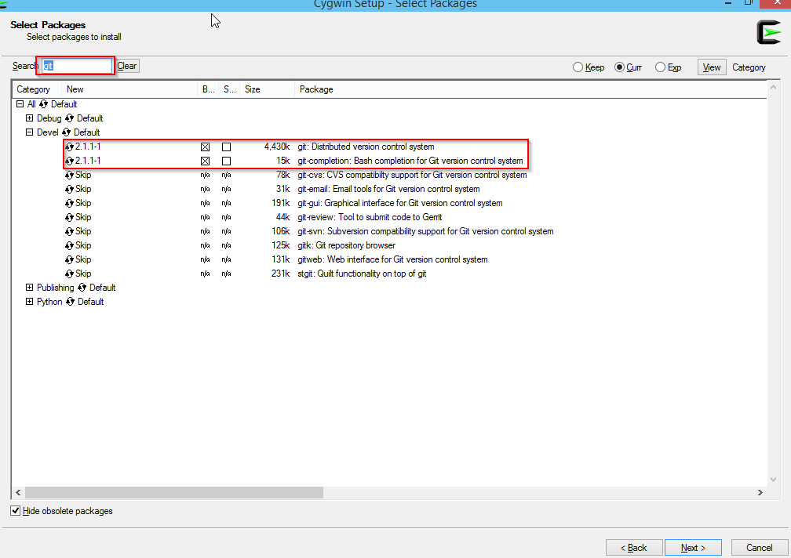

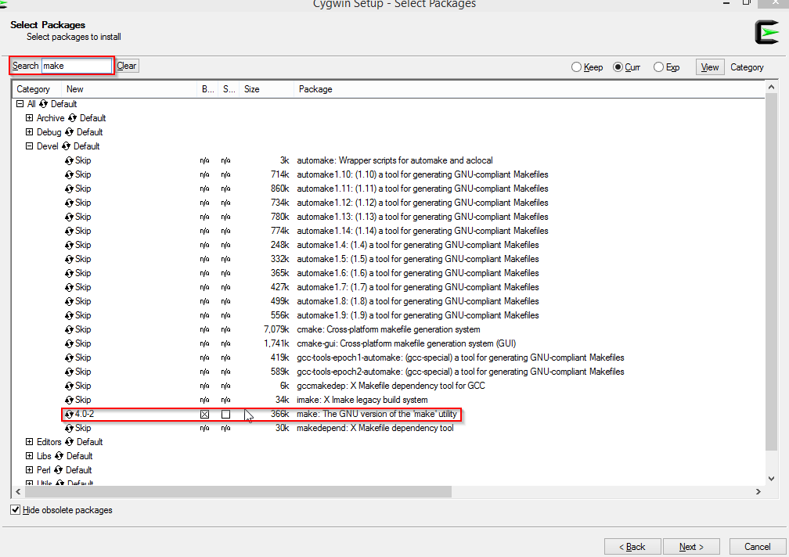

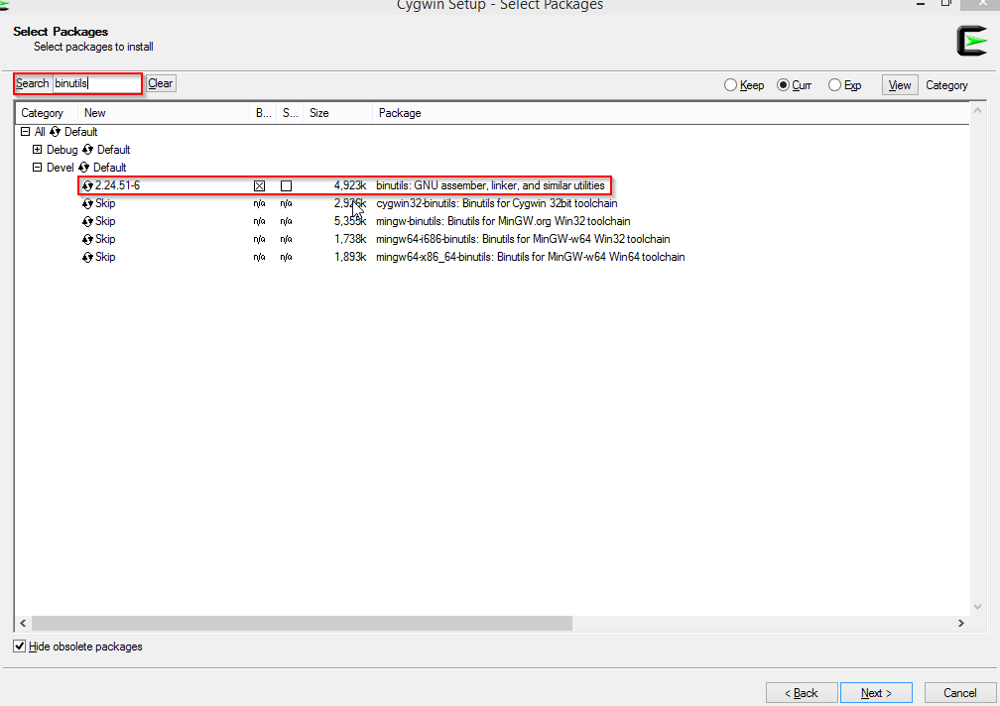

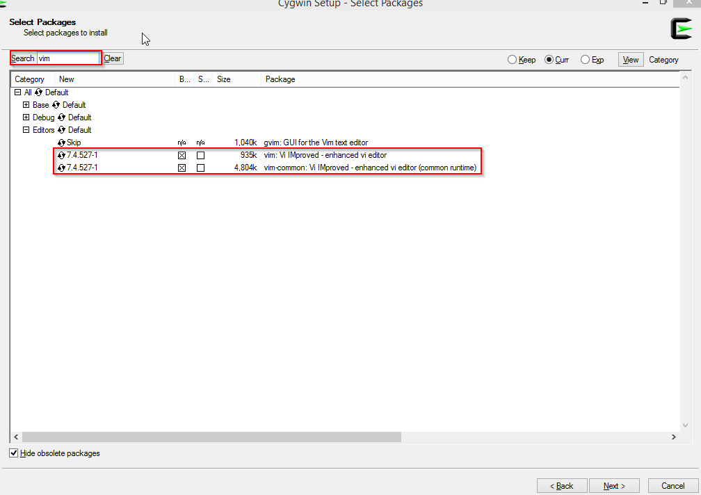

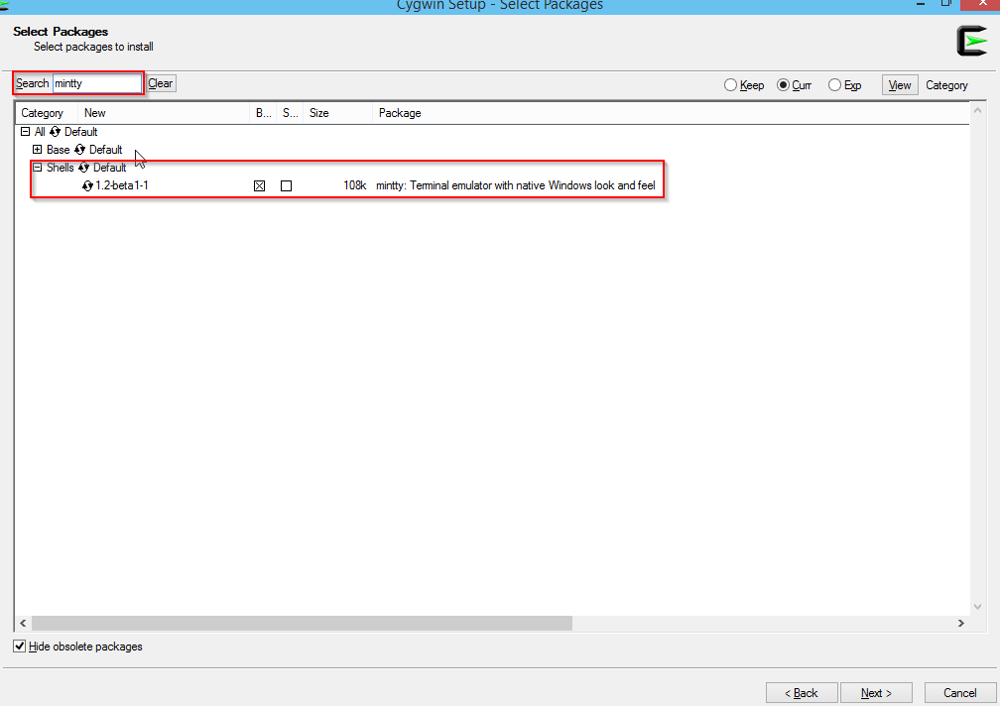


Continue with the Installation and accept all autodetected dependencies.

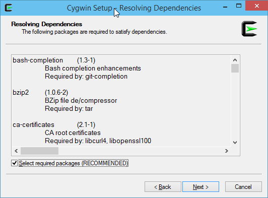


### Setup GNU ARM Toolchain

----------

versions do matter, 4.8-2014-q2 is known to work well. Download this version from https://launchpad.net/gcc-arm-embedded/+download - preferrebly as a ZIP-File.


Extract the contents of this archive to any folder of your choice, for instance ```C:\dev\gcc-arm-none-eabi-4_8-2014q2```.

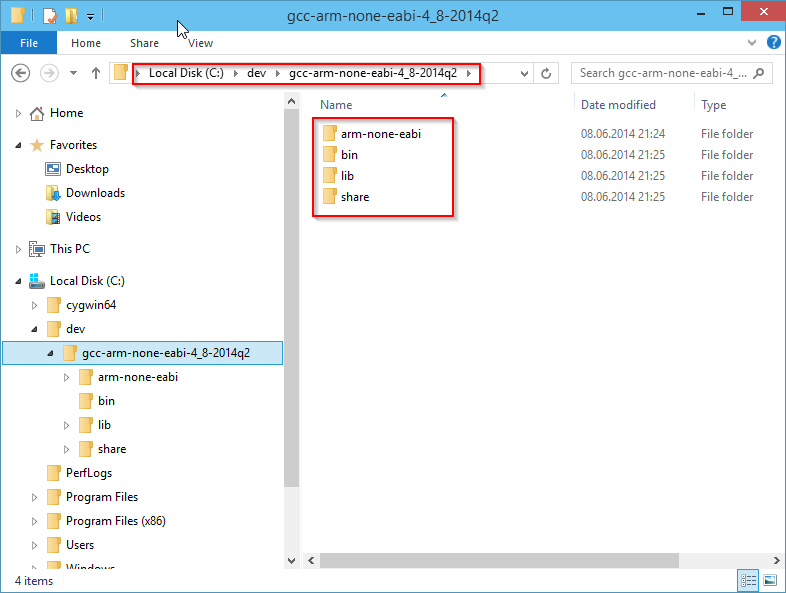

add the "bin" subdirectory to the PATH Windows environment variable: ```%PATH%;C:\dev\gcc-arm-none-eabi-4_8-2014q2\bin```

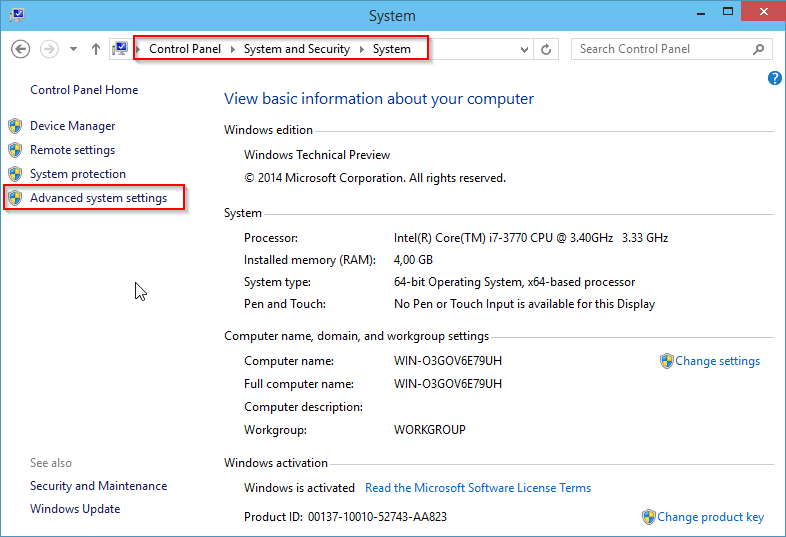

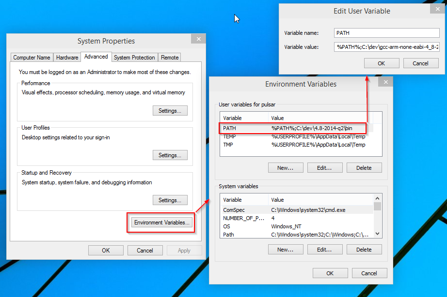

### Checkout and compile Cleanflight

Head over to the Cleanflight Github page and grab the URL of the GIT Repository: "https://github.com/cleanflight/cleanflight.git"

Open the Cygwin-Terminal, navigate to your development folder and use the git commandline to checkout the repository:

```bash
cd /cygdrive/c/dev
git clone https://github.com/cleanflight/cleanflight.git
```
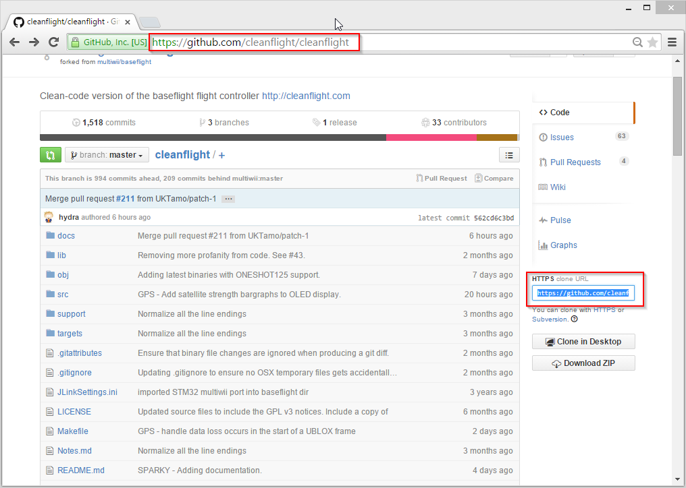

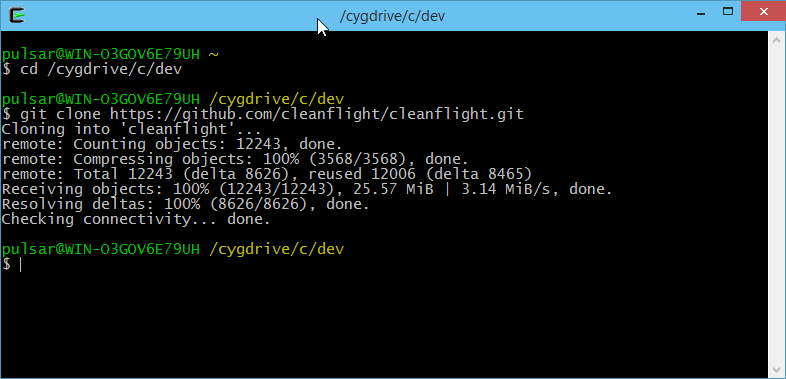

To compile your Cleanflight binaries, enter the cleanflight directory and build the project using the make command. You can append TARGET=[HARDWARE] if you want to build anything other than the default NAZE target:

```bash
cd cleanflight
make TARGET=NAZE
```

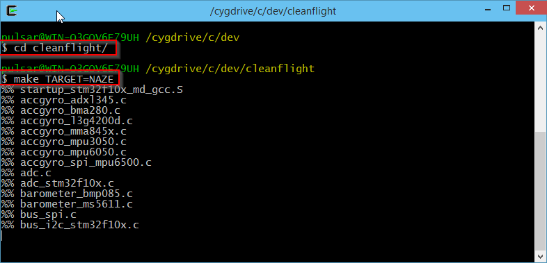

within few moments you should have your binary ready:

```bash
(...)
arm-none-eabi-size ./obj/main/cleanflight_NAZE.elf
   text    data     bss     dec     hex filename
  95388     308   10980  106676   1a0b4 ./obj/main/cleanflight_NAZE.elf
arm-none-eabi-objcopy -O ihex --set-start 0x8000000 obj/main/cleanflight_NAZE.elf obj/cleanflight_NAZE.hex
```

You can use the Cleanflight-Configurator to flash the ```obj/cleanflight_NAZE.hex``` file.

### Updating and rebuilding

Navigate to the local cleanflight repository and use the following steps to pull the latest changes and rebuild your version of cleanflight:

```bash
cd /cygdrive/c/dev/cleanflight
git reset --hard
git pull
make clean TARGET=NAZE
make
```
